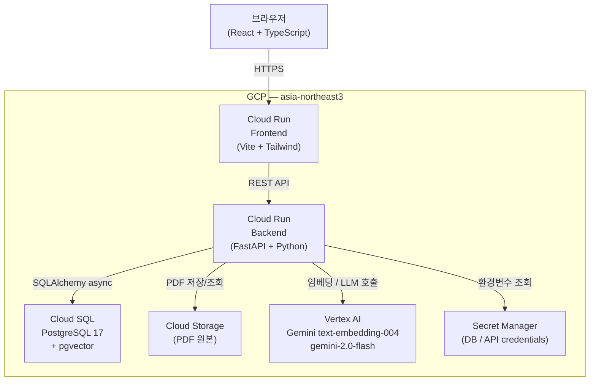
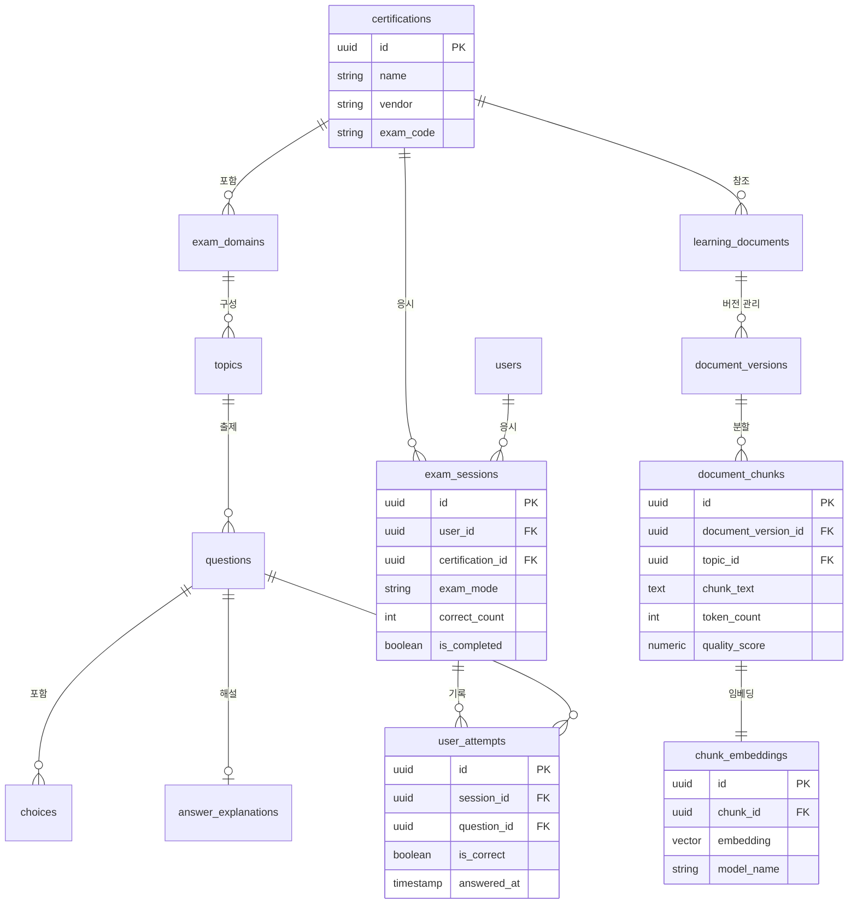
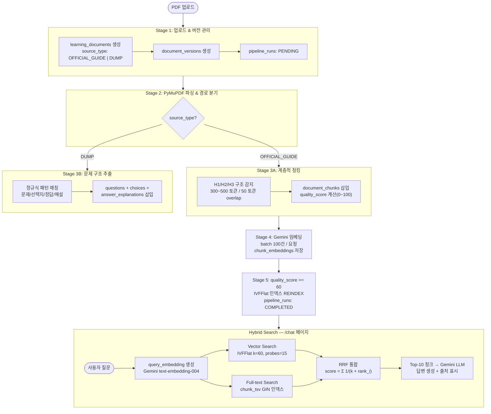

# Passly

자격증 PDF를 업로드하면 실전 시험 / 연습 / 오답 노트 / AI 질문을 제공하는 자격증 문제풀이 플랫폼.

---

## 목차

1. [프로젝트 개요](#1-프로젝트-개요)
2. [문제 정의](#2-문제-정의)
3. [전체 아키텍처](#3-전체-아키텍처)
4. [기술 스택 및 선택 근거](#4-기술-스택-및-선택-근거)
5. [데이터 모델](#5-데이터-모델)
6. [AI 파이프라인](#6-ai-파이프라인)
7. [로컬 개발 환경 세팅](#7-로컬-개발-환경-세팅)
8. [DA 포트폴리오 산출물](#8-da-포트폴리오-산출물)
9. [한계와 개선 방향](#9-한계와-개선-방향)

---

## 1. 프로젝트 개요

자격증 공식 시험 가이드 PDF와 덤프 PDF를 업로드하면 RAG 파이프라인이 자동으로 지식 베이스를 구축하고, 실전 시험 / 연습 / 오답 확인 / AI 질문 기능을 제공한다.

### 주요 기능

| 기능 | 설명 |
|------|------|
| 실전 시험 | 영역 가중치 기반 문제 배분, 타이머, 셔플, 일괄 채점, 해설 제공 |
| 연습 모드 | 토픽 선택 시 Vector Search로 관련 청크 검색 후 Gemini가 문제 즉시 생성 |
| 오답 노트 | 시험 이력 조회, 오답 재확인, 해설 토글 |
| AI 질문 | Hybrid Search(Vector + Full-text + RRF)로 관련 청크 검색 후 Gemini 답변 + 출처 표시 |

### 라이브 데모

- Frontend: https://passly-frontend-533845255542.asia-northeast3.run.app
- Backend API (Swagger): https://passly-backend-533845255542.asia-northeast3.run.app/docs

---

## 2. 문제 정의

### As-Is — 현재 자격증 공부의 문제점

- PDF 파일만 보고 단순 독학 — 능동적인 문제 풀이 환경 없음
- 덤프 파일을 별도 도구로 열어야 함 — 학습 컨텍스트 단절
- 오답 추적 없음 — 어떤 문제를 반복해서 틀리는지 파악 불가
- 취약 영역 분석 없음 — 시험 도메인별 성과를 알기 어려움

### To-Be — Passly가 해결하는 것

- PDF 업로드 한 번으로 AI 질문 답변, 문제 생성, 해설까지 자동 제공
- 자동 채점 및 시험 세션 이력 저장
- 오답 노트로 취약 문제 반복 학습
- 도메인별 정답률 분석으로 취약 영역 즉시 파악

---

## 3. 전체 아키텍처



---

## 4. 기술 스택 및 선택 근거

| 영역 | 기술 | 선택 근거 |
|------|------|----------|
| Frontend | React + TypeScript + Vite + Tailwind CSS + shadcn/ui | SaaS 스타일 UI 빠른 개발 |
| Backend | FastAPI (Python) + SQLAlchemy + Alembic | Python AI 생태계 통합, Vertex AI SDK 공식 지원 ([ADR-003](docs/09-adr.md#adr-003-fastapi-vs-spring-boot)) |
| Database | PostgreSQL 17 + pgvector | 관계형 + 벡터 검색 통합, Cloud SQL 운영 비용 최소화 ([ADR-001](docs/09-adr.md#adr-001-postgresql--pgvector-vs-opensearch)) |
| Embedding / LLM | Gemini text-embedding-004 / gemini-2.0-flash (Vertex AI) | GCP 네이티브, 서비스 계정 인증, 로컬↔GCP 코드 동일 ([ADR-004](docs/09-adr.md#adr-004-gemini-api-vs-openai-api)) |
| PDF 파싱 | PyMuPDF | 무료, 소규모 데이터, 블록 레벨 계층 구조 접근 가능 ([ADR-005](docs/09-adr.md#adr-005-pymupdf-vs-document-ai)) |
| Infra | Cloud Run + Cloud SQL + Cloud Storage + Secret Manager | 유휴 시간 0 인스턴스, 컨테이너 이미지 재사용 ([ADR-002](docs/09-adr.md#adr-002-cloud-run-vs-cloud-run--gke)) |

---

## 5. 데이터 모델

### 핵심 ERD



### 주요 설계 결정

| 결정 | 내용 | 근거 |
|------|------|------|
| document_versions 분리 | learning_documents → document_versions → document_chunks 3단계 구조 | 버전 갱신 시 기존 청크 유지. 진행 중인 시험 세션 참조 무결성 보호 |
| chunk_embeddings 1:1 분리 | 벡터(768차원)를 별도 테이블로 분리 | 비벡터 쿼리에서 대용량 벡터 로드 방지. 임베딩 모델 교체 시 청크 텍스트 영향 없음 |
| exam_sessions.correct_count 반정규화 | 시험 종료 시점의 정답 수 저장 | 대시보드 정답률 조회 시 매번 user_attempts 집계 불필요. 완료된 시험의 correct_count는 불변 |

---

## 6. AI 파이프라인

### PDF 업로드 → Hybrid Search 흐름



### RRF (Reciprocal Rank Fusion) 수식

```
RRF_score(d) = Σ 1 / (k + rank_i(d))
```

- `k = 60`: 상위 랭크 문서의 점수 집중을 완화하는 상수
- `rank_i(d)`: 검색 방식 i에서 문서 d의 순위
- Vector Search (k=60)와 Full-text Search 결과를 RRF로 통합하여 최종 랭킹 결정

---

## 7. 로컬 개발 환경 세팅

### 전제 조건

- Docker Desktop 설치
- Gemini Developer API 키 (https://aistudio.google.com)

### 실행

```bash
# 1. 레포지토리 클론
git clone https://github.com/tjdrhr02/passly.git
cd passly

# 2. 환경변수 설정
cp .env.example .env
# .env 파일에서 GEMINI_API_KEY 값 입력
# USE_VERTEX_AI=false (로컬 기본값)

# 3. 컨테이너 실행
docker-compose up -d
```

### 접속 URL

| 서비스 | URL |
|--------|-----|
| Frontend | http://localhost:3000 |
| Backend API (Swagger) | http://localhost:8000/docs |
| PostgreSQL | localhost:5432 |

---

## 8. DA 포트폴리오 산출물

| # | 산출물 | 파일 | DA 영역 |
|---|--------|------|---------|
| 1 | 데이터 표준서 | [docs/00-data-standard.md](docs/00-data-standard.md) | 전통 DA |
| 2 | 요구사항 정의서 | [docs/01-requirements.md](docs/01-requirements.md) | 컨설팅/ISP |
| 3 | 논리 ERD + 설계 근거 | [docs/02-erd-logical.md](docs/02-erd-logical.md) | 전통 DA |
| 4 | 물리 ERD / DDL | [docs/03-erd-physical.md](docs/03-erd-physical.md) | 전통 DA |
| 5 | pgvector 스키마 설계 | [docs/04-vector-schema.md](docs/04-vector-schema.md) | AI DA |
| 6 | RAG 파이프라인 설계서 | [docs/05-rag-pipeline.md](docs/05-rag-pipeline.md) | AI DA |
| 7 | 데이터 품질 규칙 | [docs/06-data-quality.md](docs/06-data-quality.md) | 거버넌스 |
| 8 | 검색 품질 평가 결과 | [docs/07-search-evaluation.md](docs/07-search-evaluation.md) | AI DA |
| 9 | ADR (Architecture Decision Records) | [docs/09-adr.md](docs/09-adr.md) | Cloud DA |
| 10 | README (포트폴리오 소개) | [README.md](README.md) | 첫인상 |

---

## 9. 한계와 개선 방향

### 현재 한계

1. **PDF 파싱 의존성**: 폰트 크기와 굵기로 제목을 감지하는 방식이 PDF 레이아웃에 따라 오탐 발생 가능. 이미지 기반 스캔 PDF는 미지원.
2. **소규모 최적화**: 2~10명 규모 설계로, 사용자 증가 시 exam_sessions / user_attempts 테이블 파티셔닝과 pgvector → 전용 Vector DB 전환 검토 필요.
3. **토픽 매핑 정확도**: 덤프 문제의 topic_id 초기 매핑이 키워드 매칭 기반으로, 의미적으로 관련된 토픽을 놓칠 수 있음.

### 향후 개선 방향

1. **LLM 기반 토픽 분류**: 키워드 매칭 → Gemini 분류로 교체하여 청크-토픽 매핑 정확도 향상.
2. **멀티 자격증 지원**: certifications 테이블 레코드 추가만으로 새 자격증을 코드 변경 없이 추가 가능한 구조를 활용하여 AZ-900, AWS SAA 등으로 확장.
3. **검색 품질 지속 평가**: docs/07-search-evaluation.md에 정의된 recall@10 측정 파이프라인을 정기 실행하여 임베딩 모델 업그레이드 및 IVFFlat lists 파라미터 조정.
