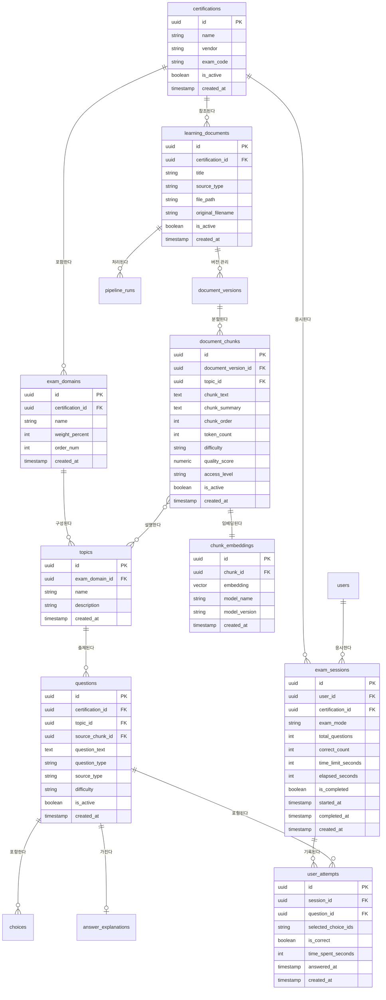

# Passly 논리 데이터 모델

> 버전: 1.0 | 작성일: 2025-06
> 이 문서는 Passly의 논리 ERD와 핵심 설계 결정 근거를 담는다.
> ERD 그림만으로는 DA 역량을 증명하기 어렵다.
> 왜 이렇게 설계했는가가 더 중요하다.

---

## 1. 엔터티 목록 및 정의

| 엔터티 | 테이블명 | 분류 | 설명 |
|--------|----------|------|------|
| 자격증 | certifications | 마스터 | 학습 대상 자격증 |
| 시험 영역 | exam_domains | 마스터 | 자격증별 출제 영역 및 가중치 |
| 학습 개념 | topics | 마스터 | 영역 내 세부 학습 개념 |
| 학습 문서 | learning_documents | 원장 | 업로드된 PDF 원본 |
| 문서 버전 | document_versions | 이력 | 문서 재업로드/갱신 이력 |
| 문서 청크 | document_chunks | 원장 | RAG 검색 최소 단위 |
| 청크 임베딩 | chunk_embeddings | 파생 | pgvector 저장 벡터 |
| 문제 | questions | 원장 | 덤프 파싱 + AI 생성 |
| 선택지 | choices | 종속 | 객관식 문제 선택 항목 |
| 정답 해설 | answer_explanations | 종속 | 정답 및 해설 텍스트 |
| 사용자 | users | 마스터 | 서비스 사용자 |
| 시험 세션 | exam_sessions | 이력 | 시험 응시 단위 |
| 풀이 이력 | user_attempts | 이력(불변) | 문제별 응답 기록 |
| 파이프라인 실행 | pipeline_runs | 이력 | PDF 처리 실행 이력 |
| 공통 코드 | code_values | 코드 | 고정 값 목록 관리 |

---

## 2. 논리 ERD (Mermaid)

---

## 3. 핵심 설계 결정 근거

### 결정 1. document_versions를 별도 테이블로 분리한 이유

**배경**: 같은 자격증의 시험 가이드는 버전이 갱신된다. 기존 청크와 새 청크가 공존해야 한다.

**설계**: `learning_documents` → `document_versions` → `document_chunks` 3단계 구조.

**근거**:
- 버전 갱신 시 기존 청크를 즉시 삭제하면 진행 중인 시험 세션이 깨진다.
- `document_versions`로 버전별 청크를 독립 관리하면 `is_active` 플래그만 전환해서 안전하게 전환 가능.
- 이전 버전 청크를 통해 "이 문제가 어느 버전 문서 기준인가"를 추적할 수 있다.

**트레이드오프**: 조회 시 JOIN depth가 1단계 증가. 청크 조회 쿼리에 인덱스 설계 필요.

---

### 결정 2. chunk_embeddings를 document_chunks와 1:1 분리한 이유

**배경**: 임베딩 벡터는 768차원 float 배열로 크기가 크다.

**설계**: `chunk_embeddings` 테이블에 `embedding vector(768)` 별도 저장.

**근거**:
- 임베딩이 필요 없는 쿼리(문제 목록 조회, 품질 점수 집계 등)에서 대용량 벡터를 불필요하게 로드하지 않는다.
- 임베딩 모델 버전이 바뀌면 `chunk_embeddings`만 재생성하면 된다. 청크 텍스트는 영향 없음.
- pgvector index는 `chunk_embeddings` 테이블에만 생성. 인덱스 크기 최소화.

**트레이드오프**: RAG 검색 시 JOIN이 1회 추가된다. 검색 쿼리에서 허용 가능한 수준.

---

### 결정 3. exam_sessions에 correct_count를 반정규화한 이유

**배경**: 대시보드에서 "최근 5회 시험 정답률"을 자주 조회한다.

**설계 (정규화 원칙)**: `user_attempts`를 COUNT + GROUP BY해서 계산.

**문제점**: 문제 수가 많아지면 매번 수백~수천 건의 attempts를 집계해야 한다. 대시보드 페이지 로딩마다 발생.

**반정규화 적용**: `exam_sessions.correct_count` 컬럼에 시험 종료 시점의 정답 수를 저장.

**근거**:
- 시험이 완료되면 correct_count는 변하지 않는다. 이후 집계 결과가 달라질 이유가 없다.
- 데이터 불일치 가능성이 없는 상태에서의 반정규화는 정당하다.
- 정답률 조회 시 `correct_count / total_questions`로 즉시 계산 가능.

**문서화 위치**: `docs/03-erd-physical.md` DDL에 주석으로 반정규화 사유 명시.

---

### 결정 4. user_attempts를 불변(immutable) 이력으로 설계한 이유

**배경**: 사용자가 오답을 확인하고 복습하는 기능의 기반 데이터.

**설계**: `is_deleted` 컬럼을 가지지만 절대 `true`로 변경하지 않는다.

**근거**:
- 시험 결과는 "사실"이다. 나중에 삭제하면 정답률 통계가 왜곡된다.
- 오답 노트, 약점 분석의 신뢰성이 이력의 불변성에 달려 있다.
- 감사 추적(audit trail)이 가능해야 "내가 이 문제를 몇 번 틀렸는가"를 정확히 알 수 있다.

**구현**: API 레벨에서 user_attempts DELETE 엔드포인트 미제공. AGENTS.md 절대 금지 항목에 명시.

---

### 결정 5. questions에 source_chunk_id를 FK로 연결한 이유

**배경**: AI 생성 문제는 특정 문서 청크를 기반으로 만들어진다.

**설계**: `questions.source_chunk_id` → `document_chunks.id` FK.

**근거**:
- "/chat 기능"에서 문제 해설 시 "이 문제는 어떤 문서의 어떤 부분을 기반으로 했는가"를 표시할 수 있다.
- 데이터 거버넌스 관점에서 AI 생성 콘텐츠의 출처를 추적할 수 있다.
- 청크가 비활성화되면 해당 청크 기반 문제도 검토 대상임을 알 수 있다.

**트레이드오프**: 덤프에서 파싱된 문제는 source_chunk_id가 NULL. NULLABLE FK.

---

## 4. 정규화 검토 결과

### 1NF 검토
- 모든 컬럼이 단일 값인가: ✅
- `user_attempts.selected_choice_ids`는 복수 선택 답안을 JSON 배열로 저장. 이 경우만 예외 허용 (choices 테이블 JOIN 복잡도 vs 단순 JSON 조회 트레이드오프로 JSON 선택).

### 2NF 검토
- 복합 PK 없음. 모든 테이블이 단일 UUID PK. 2NF 자동 충족.

### 3NF 검토
- `exam_sessions.correct_count` — 의도적 반정규화 (위 결정 3 참고)
- 나머지 컬럼은 모두 PK에 직접 종속. ✅

---

## 5. 향후 확장 고려

| 확장 시나리오 | 현재 구조에서의 대응 |
|-------------|-------------------|
| 자격증 추가 | certifications 레코드 추가 + 관련 domains/topics 추가. 코드 변경 없음 |
| 임베딩 모델 교체 | chunk_embeddings 재생성. document_chunks 영향 없음 |
| 사용자 증가 | exam_sessions, user_attempts 파티셔닝 고려 (created_at 기준) |
| 서술형 문제 추가 | question_type에 ESSAY 코드값 추가 + answers 테이블 확장 |